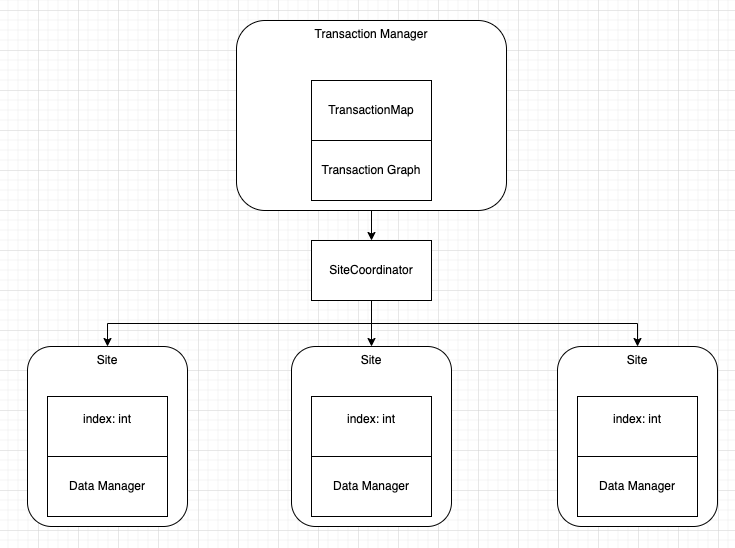

# CSCI-GA.2434-001- Advanced Database Systems
# Fall 2024
Mingyi Lim:

ml9027@nyu.edu

# Replicated Concurrency Control and Recovery (RepCRec)

## Summary
This project aims to implement a distributed database with serializable snapshot isolation, replication and failure recovery using the available copies method.

## Running the Project
The project is written almost entirely in golang.
To run the project, ensure you have golang installed

1. Build the binary
    ``` 
    make
    ```
2. Run  
    ```
    ./repcrec <inputfile>
    ```
3. To output results to a file, use 
    ```
    ./repcrec <inputfile> >> <outputfile>
    ```

The program will output each line from the input, followed by the outcome of the operation. If any error is encountered during the parasing of the file or the operation of the program, it will terminate with the specified error.


## Design
The high level design of the database is as follows:



### Transaction Manager
The transaction manager acts as the interface with the database. Contains the transaction details of active transactions, a transaction graph for cycle detection and contains the main logic for executing transactions.

A rough overview of the class is as follows:

```
type TransactionManager interface {
	Begin(tx int, time int) error
	End(tx int, time int) (CommitResult, error)
	Write(tx int, key int, value int, time int) (WriteResult, error)
	Read(tx int, key int, time int) (ReadResult, error)
	Recover(site int, time int) error
	GetTransaction(tx int) (*Transaction, bool, error)
}

def Begin(transaction int, time int) -> Adds a transaction to the transaction pool

def End(transaction: Tx, time int) -> checks for RW cycles, write conflicts and site failures and tries to commit transaction if possible. Removes transaction from transaction_graph and map once done committed or aborted.

def Read(transaction: Tx, key: int, time int) -> Retrieves available sites for reads and attempts to read from any valid site, or waits if there is possible site which is currently down. Returns result if successful. Might abort transaction immediately if no sites are viable. 

def Write(transaction: Tx, key: int, value: int, time int) -> Attempts to write to all replicas of a site. Waits if no replicas are available to be written to.

def Recover(site: int) -> starts executing operations on transactions waiting for specific site

def GetTransaction(tx int) -> Gets a transaction, whether it's waiting and error if an error occurs
```

### Transaction
Each transaction stores its start time, status completed operations and pending operations in case it is waiting for a site to be made available.

The rough model of a transaction is as follows:
```
type Transaction struct {
	id                  int
	startTime           int
	siteWrites          map[int]Operation
	pendingOperations   []Operation
	completedOperations map[int][]Operation
	waitingSites        map[int]bool
	state               TransactionState
}
```

### TransactionGraph
The transaction Graph is represented as a directed graph, with nodes represented by the transaction id and edges added to the graph as values of these nodes.

type TransactionGraph struct {
	graph map[int]map[int]ConflictType
}

### Site Coordinator
The site coordinator keeps track of the uptime and history of each site, as well as it's current status. It also helps to retrieve relevant sites for the transaction manager.

The Site coordinator is also used for sending Up and down signals to the sites

```
type SiteCoordinator interface {
	Fail(site int, time int) error
	Recover(site int, time int) error
	Dump() string
	ReadActiveSite(site int, key int, time int) (HistoricalValue, error)
	GetSitesForKey(key int) []int
	GetActiveSitesForKey(key int) []int
	GetValidSitesForRead(key int, txStart int) []int
	VerifySiteWrite(site int, key int, writeTime int, currentTime int) SiteCommitResult
	CommitSiteWrite(site int, key int, value int, time int) error
}
```

### Site/DataManager
Sites are simply abstract representations of the data managers.
The DataManager at each site keeps track of the values held within the site, as well as the commit history of each value.
It also holds pending writes to values for each transaction (as volatile writes)
```
type DataManager interface {
	Dump() string
	Read(key int, time int) HistoricalValue
	Commit(key int, value int, time int) error
	GetLastCommitted(key int) HistoricalValue
}
```

## Testing 
We provide unit tests in the /test folder.
To run unit tests, execute 
``` 
make test 
```
This will run the unit tests linked to the test scripts in the ```test/resources``` folder


